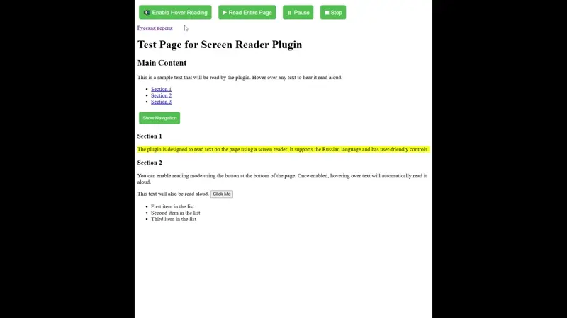

# README

[English version](README.md)

Плагин для WordPress, который добавляет функциональность экранного диктора на сайт. Он использует встроенный в браузер api для воспроизведения текста (speechSynthesis), поддерживает браузеры Chrome, Firefox, Safari и Edge.



## Возможности

- Чтение текста при наведении курсора (режим "Читать под курсором")
- Управление воспроизведением: все кнопки (Включить/Выключить чтение под курсором, Читать всю страницу, Пауза, Стоп) всегда видимы в один ряд
- Чтение всей страницы (режим под курсором временно отключается, затем возвращается)
- Пауза и продолжение чтения с того же места
- Остановка чтения при переходе к новому элементу или при нажатии Стоп
- Автоматическая остановка воспроизведения при перезагрузке страницы
- Поддержка русского языка
- Исключение ненужных элементов (навигация, меню, футеры)

## Разработка и тестирование

### Установка зависимостей

```bash
npm install
```

### Запуск dev-сервера

```bash
npm run dev      # Запускает webpack-dev-server на порту 9000
```

### Сборка для продакшна (in progress)

```bash
npm run build
```

### Тестирование

1. Соберите проект: `npm run dev`
2. Откройте в браузере `http://localhost:9000`
3. Все кнопки управления видимы в верхней части страницы
4. "🔊 Включить чтение" — включает/выключает режим чтения под курсором
5. "▶️ Читать всю страницу" — озвучивает весь текст, временно отключая режим под курсором
6. "⏸ Пауза" — ставит чтение на паузу, повторное нажатие "Читать всю страницу" продолжит с того же места
7. "⏹ Стоп" — полностью останавливает чтение
8. При перезагрузке страницы воспроизведение всегда останавливается

## Файлы проекта

- `src/screen-reader.js` — Основная логика плагина
- `src/screen-reader.css` — Стили для плагина
- `src/screen-reader.php` — PHP файл для WordPress
- `test_page/index.html` — Тестовая страница
- `webpack.config.js` — Конфигурация сборки

## Структура после сборки

После сборки в папке `test_page/` появится файл `screen-reader.bundle.js`, который включает весь JavaScript и CSS код.

## TODO:
- Реализовать build script, для упаковки плагина в zip. 
